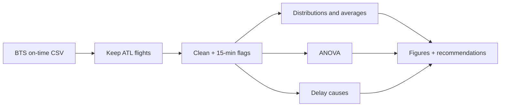

# Atlanta Airport Delay Analytics

This repository is a modern Python reimplementation of an operations analytics project originally completed during my graduate studies at Cornell University.

The original Six Sigma / DMAIC study looked at Hartsfield-Jackson Atlanta International Airport (ATL) using about 350,000 Bureau of Transportation Statistics flights from 2015. We asked which delay drivers were airline-controllable, which were seasonal or city-specific, and what that implied for operations.

This repo rebuilds the analysis in Python. The original work used JMP and the BTS / RITA extracts. It was not written in this codebase.

## What this project demonstrates

- Cleaning and summarizing a large on-time performance dataset for one hub (ATL)
- Delay measurement against the FAA 15-minute threshold
- Breakdowns by airline, month, and city, plus BTS delay-cause minutes
- One-way ANOVA on airline type, month, and distance
- A split between airline-controllable delays (carrier, late aircraft) and delays that are largely external (weather, NAS, security)
- Operational recommendations tied to those results, kept separate from the original 2015 study findings

## Business problem

Flight delays waste passenger time, burn extra fuel, and cascade through later flights. The FAA treats 15 minutes late as the delay threshold. The original study focused on ATL because of its volume, and on air-carrier and late-aircraft delays because those can be measured and, in principle, managed.

## Dataset

| Source | What it is |
| --- | --- |
| Original study | BTS / RITA on-time data, 2015, ATL origin or destination, about 350,000 flights |
| Bundled sample | 3,000 real BTS ATL flights from January 2015 (`data/sample/atl_flights_sample.csv`) |
| Full rebuild | `scripts/download_bts.py` pulls official monthly BTS zips and keeps ATL flights |

The sample is real public data, not invented records. It is only one month, so monthly and year-scale findings from the paper will not reproduce on the sample alone.

```bash
python scripts/download_bts.py --year 2015 --months 1-12
python scripts/run_pipeline.py
python scripts/run_pipeline.py --path /path/to/your_flights.csv
```

## DMAIC method

**Define.** ATL arrival and departure delays, using the 15-minute FAA rule.

**Measure.** BTS fields: scheduled vs actual times, airline, month, city, distance, and delay cause minutes (carrier, late aircraft, weather, NAS, security).

**Analyze.**

- Delay distributions (original JMP fits used positive delays only)
- Averages by airline, month, and city
- One-way ANOVA on airline type, month, and distance
- Airline groups from the original Table 1: Major (AA, DL, UA), Medium (AS, F9, NK, US, WN), Regional (EV, MQ, OO)
- Controllable vs largely uncontrollable delay minutes
- A wage-loss illustration using the original assumptions ($22/hour, 123 passengers)

**Improve / Control.** Recommendations stay at the level of the original report: regional-carrier operations, holiday capacity, and smaller-city ground handling. This repo does not simulate interventions.



## Key findings

### Original study (2015, full ATL year)

These points come from the Cornell report, not from the bundled sample:

- Mean departure delay was higher than mean arrival delay. The interpretation was that some departure loss is recovered in the air.
- Positive delays were described as log-normal after zeros were dropped (zeros were most of the data).
- After blocking month, airline type still mattered. Regional carriers had higher and more spread-out delays.
- Distance was not treated as an important arrival-delay factor.
- Arrival and departure averages for Frontier, Envoy, Spirit, and United sat above the 15-minute line in the paper's charts.
- Summer (May-August) and December showed higher average delays, still often under 15 minutes.
- Some smaller origin cities had high average delays. The paper's wage illustration on cities over 15 minutes was about $19.8 million using $22/hour and 123 passengers per flight.
- Recommendations: raise smaller-city operations, support regional carriers, smooth holiday operations, and watch airfield capacity.

### This Python run (January 2015 sample, 2,967 operated flights)

- Mean departure delay **6.83** minutes; mean arrival delay **0.90** minutes. Same direction as the paper: departures look worse than arrivals.
- **14.8%** of sample arrivals were 15 or more minutes late.
- Airline type is significant for both departure delay ($p \approx 0.015$) and arrival delay ($p < 0.001$).
- Month ANOVA is not identified here because the sample is January only.
- Distance group is significant on this sample ($p \approx 0.013$). That does **not** match the original year-long conclusion. Treat it as a sample result, not a rewrite of the paper.
- The wage illustration on this 3,000-row file is about **$104k**. It uses the paper's $22/hour and 123-passenger assumptions. It is not the $19.8M year-scale figure.

Numbers live in `outputs/run_summary.json`. If you download the full 2015 ATL file, report those results separately from the paper.

## Charts

`scripts/run_pipeline.py` writes five plots to `outputs/figures/`:

1. Arrival delay histogram (positive delays, 15-minute line)
2. Average arrival delay by month
3. Average arrival delay by airline
4. Arrival delay rate by airline
5. Total BTS delay minutes by cause

## Layout

```
atlanta-airport-delay-analytics/
├── data/sample/atl_flights_sample.csv
├── data/raw/                 # download target, gitignored
├── src/                      # load, clean, analyze, ANOVA, plots
├── scripts/run_pipeline.py
├── scripts/download_bts.py
├── notebooks/analysis.ipynb
├── outputs/
└── tests/test_analysis.py
```

## How to run

```bash
python3 -m venv .venv
source .venv/bin/activate
pip install -r requirements.txt

python scripts/run_pipeline.py
pytest -q
```

## Stack

Python 3, pandas, numpy, scipy, matplotlib, pytest.

## Why I keep this around

The useful part is still the operations question: which delays you can staff and schedule around, and which you mostly absorb. If that is clear from the charts and the ANOVA, the repo did its job.
